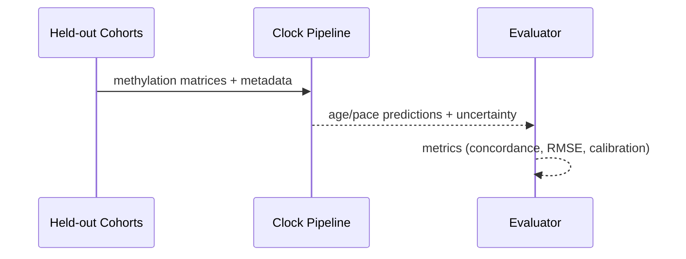

# Clock Inference

Objective: Harmonize methylation endpoints across EPIC/EPICv2 and deliver clocks with uncertainty and calibration.

Inputs
- Public EPIC/EPICv2 cohorts (GEO/ArrayExpress)
- Pretrained aging/risk clocks (Horvath, Hannum, PhenoAge, GrimAge)
- Pace-of-aging clocks (DunedinPoAm/PACE)

Methods
- Probe mapping/harmonization; imputation for EPICv2 gaps
- Multi-clock ensemble with calibration 
- Cross-cohort normalization to reduce batch effects

Outputs
- Biological age deltas and pace metrics with error bars
- Sensitivity to top probes/gene regions

Validation
- Hold-out cohorts; concordance with chronological age and outcomes
- Robustness to batch and tissue differences

Roadmap
1) Implement harmonization and baseline ensemble
2) Add uncertainty via jackknife/bootstraps
3) Clinical alignment and thresholds for risk interpretation

### Harmonization Flow

### Validation Design

