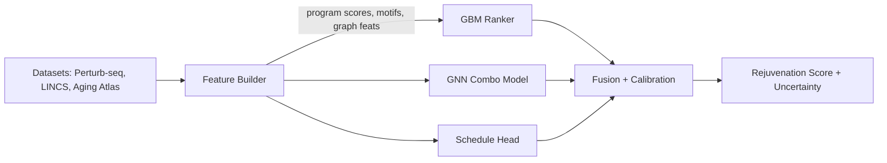
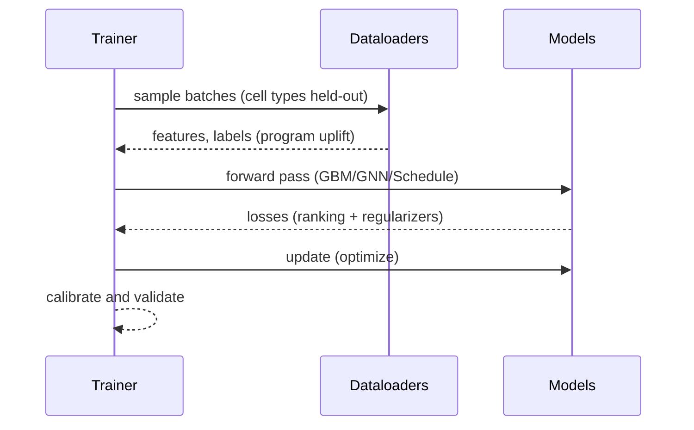
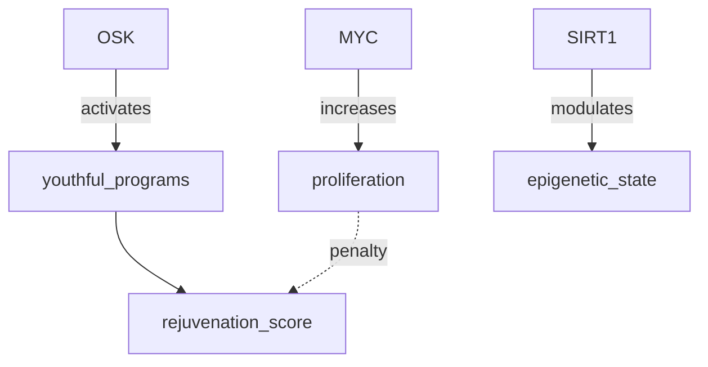

# Reprogramming Predictor

Objective: Predict TF combinations and pulse schedules that shift aged cells toward youthful state while avoiding dedifferentiation.

Data
- Perturb-seq and combinatorial CRISPRa/i datasets (Dixit 2016; Adamson 2016; Replogle 2020–2022)
- LINCS L1000 signatures for small molecules (Subramanian 2017)
- Aging Atlas multi-omics programs; gene set priors (cell cycle, EMT, pluripotency)

Features
- Program scores (youthful vs aged), pathway activities, TF motif enrichments
- Time/pulse encodings (hours from 24h optimum, duty cycle features)
- Graph features over regulatory networks (TF–target edges)

Models
- Ranking model (e.g., XGBoost/LightGBM) for rejuvenation score
- Graph-enhanced predictor for TF combo interactions (GNN or DeepSets)
- Schedule head for pulse-hours effect (monotone constraints toward 24h window)

Training and Validation
- Train on held-out cell types; evaluate uplift in youthful program scores
- Cross-dataset generalization (Perturb-seq → LINCS proxy tasks)
- Calibrate scores with temperature scaling; report uncertainty via ensembles

Guardrails (Safety-Aware)
- Penalize activation of pluripotency/cell-cycle programs
- Hard constraints against risky gene sets (e.g., MYC-heavy regimes)

Outputs
- Rejuvenation score (0–100), calibrated uncertainty
- Rationale: top contributing programs/genes and schedule sensitivity

Roadmap
1) Baseline gradient boosting with program features
2) Add GNN interaction terms for TF combos
3) Joint multi-task training with safety sentinel

### Architecture Overview

### Training Loop

### Feature Graph (Example)

