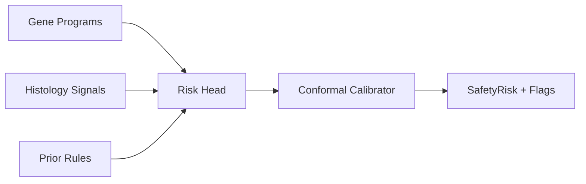
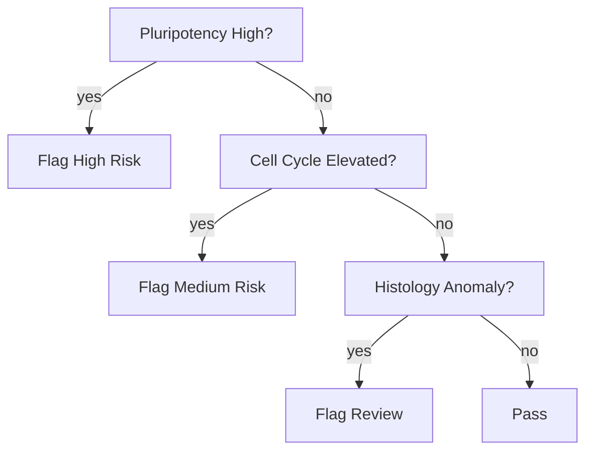

# Safety Screening

Objective: Predict dedifferentiation and proliferation risk; surface safety flags alongside efficacy.

Signals
- Gene programs: pluripotency, EMT, cell cycle, apoptosis, senescence
- Morphology/histology (if available): weak supervision from public models
- On-target vs off-target effects inferred from CRISPR controls

Models
- Binary/ordinal risk head trained on curated risky regimes (MYC, OSKM long pulses)
- Conformal risk sets for calibrated thresholds

Validation
- Backtest on literature cases (Ohnishi 2014; Abad 2013)
- Holdout perturbation sets; check precision for high-risk calls

Reporting
- SafetyRisk (0–100) lower is safer; top contributing programs and thresholds
- “Why” section with evidence snippets and prior rules triggering

Roadmap
1) Program-based logistic baseline with priors
2) Add conformal calibration and cost-sensitive training
3) Integrate weakly supervised histology signals

### Safety Architecture

### Decision Logic (Sketch)

