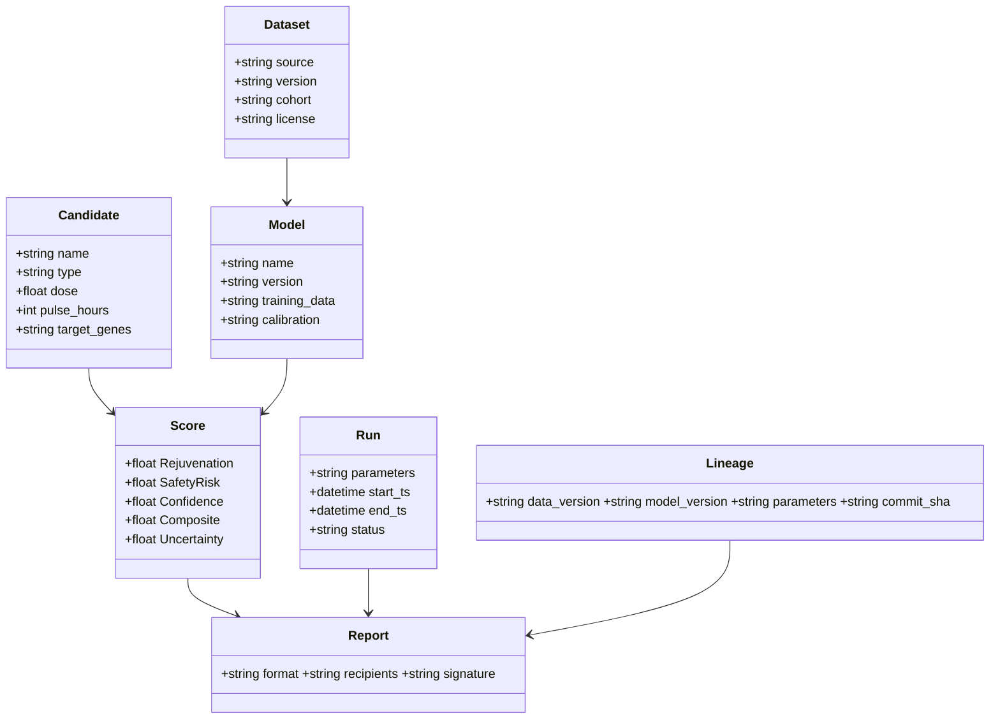

# ARISE Conceptual View (RM-ODP)

## Enterprise, Information, and Computational (Conceptual level)

### Mission and Outcomes
- Accelerate safe aging‑reversal research by triaging interventions in silico before wet‑lab.
- Co‑optimize rejuvenation potential with safety confidence and transparent uncertainty.
- Produce decision‑grade, reproducible reports consumable by clinicians and researchers.

### Non‑Goals
- Not a diagnostic or therapeutic device. Not a replacement for prospective validation.

### Stakeholders and Decisions
- Clinicians: prioritization and safety red‑flags.
- Bench Scientists: candidate selection, protocols, and minimal validation plans.
- IRB/Compliance: evidence trails, model lineage, and risk mitigation.
- Data Scientists/ML Engineers: data quality, feature design, calibration, uncertainty.
- Sponsors/Investors: time‑to‑insight, reproducibility, and risk profile.

### Value Stream (Idea → Evidence)
1. Formulate hypotheses and target spaces (genes, small molecules, schedules).
2. Ingest public or proprietary datasets; normalize and QC.
3. Simulate virtual interventions at scale; predict multi‑objective scores.
4. Rank and explain; quantify uncertainty and safety risks.
5. Deliver clinician‑ready report and minimal wet‑lab validation plan.
6. Close the loop with lab outcomes; update models and priors.

### Business Scenarios
- Program lead wants a safe shortlist for organoid assays next week.
- Clinic wants to compare ARISE triage vs standard of care for an IRB pilot.
- Biotech seeks repurposing signals across LINCS/OT + methylation clocks.

### Policies and Principles
- Evidence > hype; show lineage and uncertainty alongside scores.
- Safety is co‑primary with efficacy at every stage.
- Privacy‑by‑design for any patient‑linked data; minimize/aggregate by default.
- Reproducibility: pinned data and model versions; deterministic pipelines where feasible.

### Success Metrics
- Time‑to‑shortlist, hit‑rate uplift vs baseline, safety incident rate, reproducibility rate, auditability.

### Core Concepts (Information at conceptual level)
- Candidate: {name, type, dose, pulse_hours, target_genes}
- Scores: {Rejuvenation, SafetyRisk, Confidence, Composite, Uncertainty}
- Dataset: {source, version, cohort, license}
- Model: {name, version, training_data, calibration}
- Run: {parameters, start_ts, end_ts, status}
- Report: {format, recipients, signature}
- Lineage: {data_version, model_version, parameters, commit_sha}

### Conceptual Process (Happy Path)

### Risks and Mitigations
- Model miscalibration → use external validation, conformal prediction, and periodic recalibration.
- Data shift → monitor drift; version datasets; alert on schema/content changes.
- Misuse risk → clear disclaimers; IRB review for clinical pilots; human‑in‑the‑loop gatekeeping.

### Glossary (selected)
- Partial Reprogramming: transient expression of rejuvenation TFs without pluripotency conversion.
- Epigenetic Clock: methylation‑based estimator of biological age or risk.
- Uncertainty: quantified predictive variability (aleatoric/epistemic).
