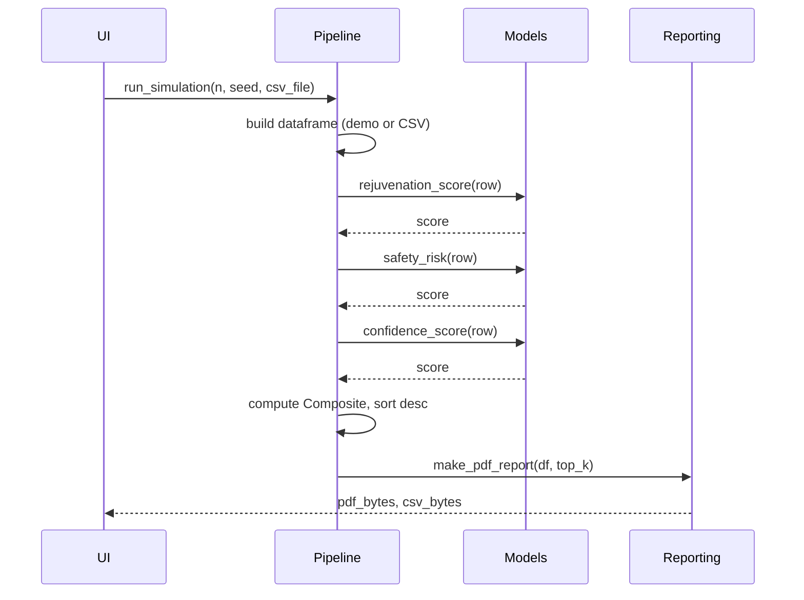
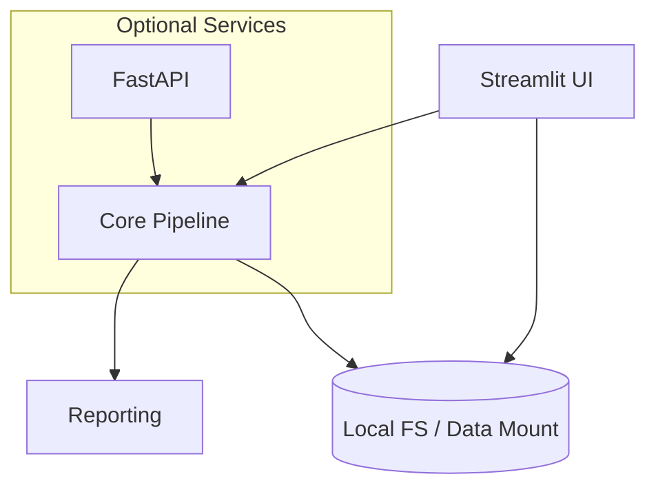

# ARISE Logical View (RM-ODP)

## Computational and Engineering (Logical level)

### Logical Services and Responsibilities
- Ingest: validate schema, normalize, QC, and enrich with identifiers.
- Simulate: generate candidates; run predictors across modalities.
- Score: compute rejuvenation, safety, confidence; calibrate and fuse into Composite.
- Report: build clinician PDF/CSV with rationale and next steps.
- Audit: persist lineage (data_version, model_version, commit_sha, parameters).

### Primary Interfaces
- UI → Pipeline: `run_simulation(n, seed, csv_file)`
- Pipeline → Reporting: `make_pdf_report(df, top_k)`
- API (optional): `POST /score` accepts CSV and returns top‑K JSON.

### Data Contracts (in/out)
- Input CSV: `name,type,dose,pulse_hours,target_genes`
- Output frame: adds `Rejuvenation,SafetyRisk,Confidence,Composite,(Uncertainty)`

### Scoring Workflow (Sequence)

### Error Handling and Idempotency
- Validate schema strictly; return actionable error suggesting required columns.
- Deterministic runs with fixed seeds (where applicable); document non‑deterministic components.

### Caching and Performance
- Cache feature transforms; memoize dataset normalizations.
- Batch scoring for vectorized operations; consider multiprocessing for large N.

### Security and Privacy (Logical)
- Inputs treated as sensitive; never log raw PII.
- Data erasure policy and retention windows; scrub uploads after run unless opted‑in.

### Non‑Functional Requirements (Targets)
- Latency: < 5s for 2k candidates on laptop; < 1s for PDF generation.
- Reproducibility: identical top‑N for fixed seed and dataset version.
- Availability (optional API): 99.5% for MVP pilot.

### Logical Deployment Sketch

### Events and Lineage
- Record `{data_version, model_version, parameters, commit_sha, timestamp}` for every run.
- Emit run summaries for audit; persist to `reports/` and (later) object storage.

### Evolution Path
- Replace toy models with trained predictors; introduce uncertainty calibration.
- Introduce orchestration (Prefect/Dagster) and message bus for scale.
